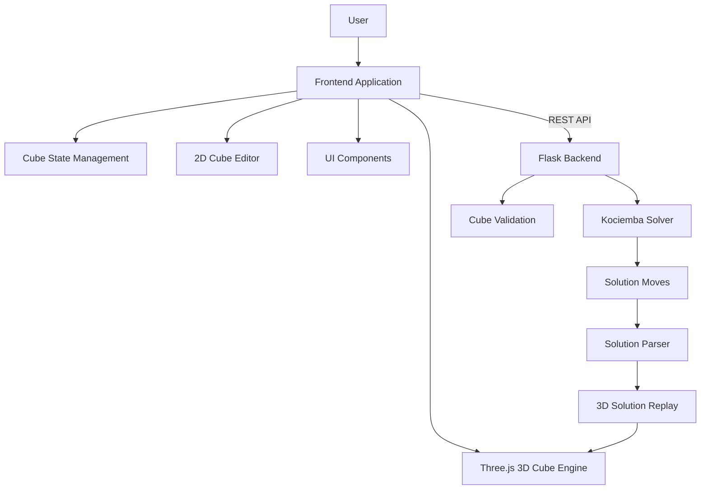
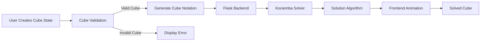

# CubeStudio

A complete web application for Rubik's Cube simulation, state editing, validation, and solving.

---

## About

CubeStudio is a full-stack Rubik's Cube platform that combines an interactive 3D simulator with a complete cube-solving workflow.

Users can:

- Manipulate a realistic 3D Rubik's Cube
- Create custom cube states using a 2D cube editor
- Validate cube configurations
- Generate optimized solutions using the Kociemba algorithm
- Visualize the solving process step by step

The project was built to explore real-world software engineering concepts by combining 3D graphics, algorithmic problem solving, frontend-backend communication, and modular application architecture.

---

# Features

## Interactive 3D Simulator

- Real-time 3D Rubik's Cube built with Three.js
- Smooth animated cube rotations
- Mouse-based camera controls
- Manual cube manipulation
- Real-time cube state synchronization

---

## Cube State Editor

- Interactive 2D Rubik's Cube representation
- Color palette based sticker selection
- Real-time cube state generation
- Import custom cube configurations into the 3D simulator
- Cube configuration validation before solving

---

## Solver System

- Flask backend integration
- Kociemba algorithm based solving
- Automatic solution generation
- Step-by-step solving animation
- Hint system
- Solution replay functionality

---

## User Experience

- Scramble functionality
- Reset cube functionality
- Move counter
- Solve timer
- Undo and redo support
- Multi-page application interface

Pages include:

```
Simulator
Solver
About
Information
```

---

## Engineering Features

- Modular JavaScript architecture
- Separation of frontend and backend responsibilities
- REST API communication
- Organized feature-based folder structure
- Scalable project design

---

# Tech Stack

## Frontend

- HTML5
- CSS3
- JavaScript (ES6+)
- Vite

## 3D Graphics

- Three.js

## Backend

- Python
- Flask

## Algorithm

- Kociemba (Python Library)

## Computer Vision

- OpenCV.js *(Experimental feature planned for v2)*

## Version Control

- Git
- GitHub

## Deployment

- Render

---

# System Architecture

CubeStudio follows a modular full-stack architecture where the frontend manages user interaction, 3D visualization, and cube state management, while the backend handles solver requests and solution generation through the Kociemba algorithm.



---

# Application Workflow



---

# Project Structure

```text
CubeStudio/

├── src/
│
│   ├── core/
│   │   ├── scene.js              # Three.js scene and camera setup
│   │   └── animate.js            # Rendering loop
│   │
│   ├── cube/
│   │   ├── cube.js               # Cubie generation
│   │   ├── rotation.js            # Cube rotation engine
│   │   ├── moves.js               # Cube move definitions
│   │   ├── state.js               # Cube state management
│   │   ├── scramble.js            # Scramble logic
│   │   ├── reset.js               # Reset functionality
│   │   └── history.js             # Undo/redo system
│   │
│   ├── input/
│   │   ├── raycast.js             # Object selection
│   │   ├── dragRotation.js        # Mouse cube rotation
│   │   ├── gesture.js             # User gestures
│   │   └── keyboard.js            # Keyboard controls
│   │
│   ├── inputMethods/
│   │   └── manually/
│   │       ├── cubeNet.js         # 2D cube representation
│   │       ├── palette.js         # Color selection system
│   │       ├── integrateCube.js   # Load state into 3D cube
│   │       └── verifyCube.js      # Cube validation
│   │
│   ├── solver/
│   │   ├── api.js                 # Backend communication
│   │   ├── cubeNotation.js        # Convert cube state
│   │   ├── solutionParser.js      # Parse solver output
│   │   ├── solverPlayer.js        # Solution animation
│   │   ├── hintController.js      # Hint functionality
│   │   ├── startController.js     # Solver start logic
│   │   └── restartController.js   # Restart functionality
│   │
│   ├── pages/
│   │   ├── simulator.js
│   │   ├── solver.js
│   │   ├── about.js
│   │   └── navigation.js
│   │
│   ├── ui/
│   │   ├── timer.js
│   │   ├── popup.js
│   │   └── updateUI.js
│   │
│   └── main.js
│
├── backend/
│   ├── app.py                     # Flask server
│   └── requirements.txt           # Python dependencies
│
├── public/
│   └── static assets
│
├── package.json
├── vite.config.js
└── index.html
```

---

# Screenshots

## Simulator


## Solver


## Cube State Editor


## About


# Future Roadmap

## Version 2

Planned improvements:

- Camera-based cube scanning using computer vision
- Automatic sticker detection
- Improved mobile experience
- Additional cube sizes
- Enhanced solving visualization

---

# Experimental Features

## Computer Vision Cube Scanner

An experimental camera-based cube scanning pipeline was developed using OpenCV.js.

The prototype explored:

- Camera access
- Image preprocessing
- Frame processing
- Cube face detection
- Color recognition experiments

Due to accuracy challenges in real-world environments, this feature is planned for future versions after further improvements.

---

# Running Locally

## Frontend

```bash
npm install

npm run dev
```

## Backend

```bash
cd backend

pip install -r requirements.txt

python app.py
```

---

# Deployment

The application will be deployed using:

- Frontend: Render
- Backend: Render

---

# Author

Prajwal Meshram

B.Tech Computer Science Engineering  
IIIT Guwahati