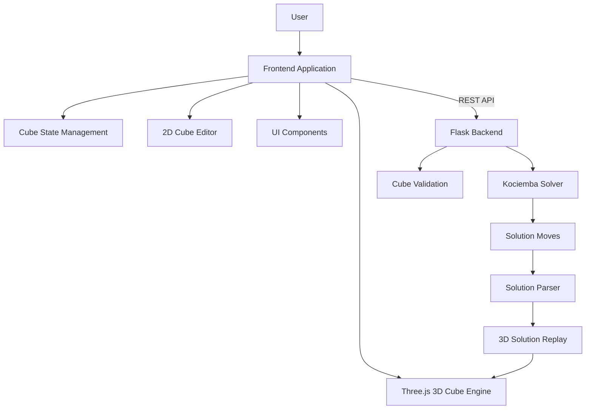
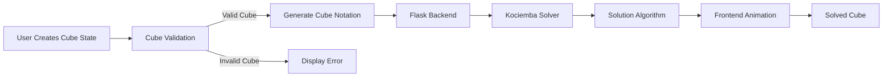
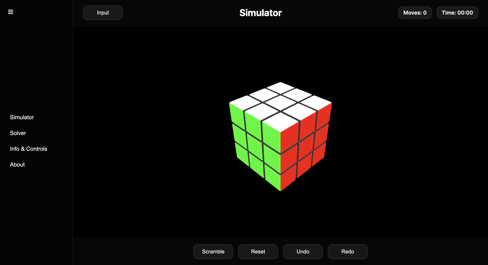
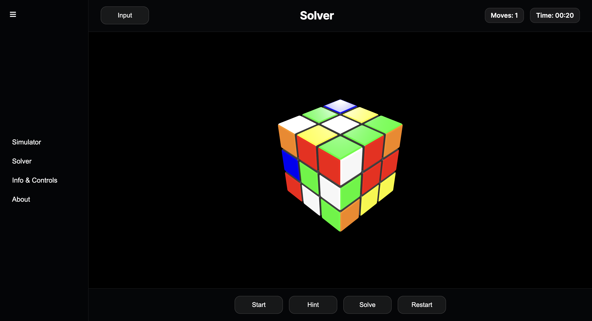
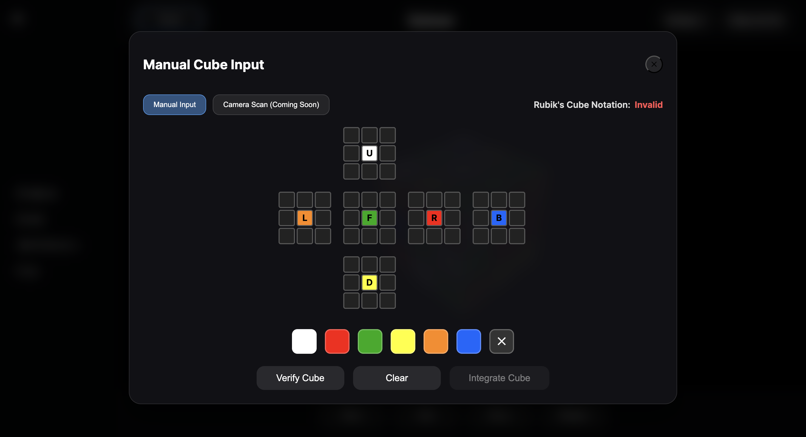
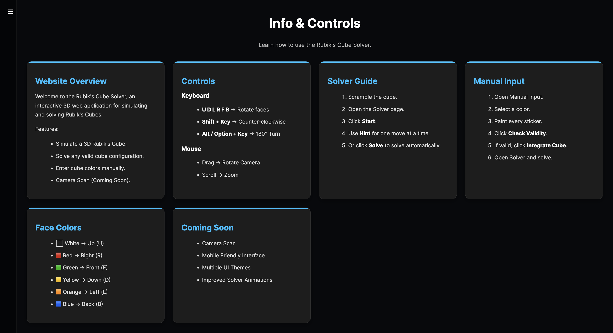

# CubeStudio

<h3 align="center">A full-stack Rubik's Cube simulation and solving platform</h3>

<p align="center">
Built with <b>Three.js</b>, <b>JavaScript</b>, <b>Flask</b>, and the <b>Kociemba algorithm</b>
</p>

<p align="center">
Interactive 3D Simulator • Cube State Editor • Validation • Solver • Step-by-Step Replay
</p>

<p align="center">
  <a href="https://cubestudio-1.onrender.com/">
    
  </a>
  <a href="https://github.com/prajwalmeshram06/CubeStudio">
    
  </a>
</p>

---

CubeStudio is a complete web application for **Rubik's Cube simulation, state editing, validation, and solving**. It combines a real-time **3D cube simulator** with a **2D cube editor**, a **solver backend**, and an animated **step-by-step solution player**.

---

## Project Overview

The project was developed to explore real-world software engineering concepts including:

* Interactive 3D graphics with Three.js
* Algorithmic problem solving
* Frontend-backend communication
* REST API integration
* Modular JavaScript architecture
* Full-stack deployment

---

## Key Features

### Interactive 3D Simulator

* Real-time 3D Rubik's Cube built with **Three.js**
* Smooth animated rotations
* Mouse-based camera controls
* Keyboard and drag interactions
* Real-time cube state synchronization

### Cube State Editor

* Interactive **2D cube net**
* Color palette-based sticker editing
* Custom cube configuration support
* Validation before solving
* Import edited states directly into the 3D simulator

### Solver System

* Flask backend integration
* **Kociemba algorithm** based solving
* Optimized solution generation
* Step-by-step solution animation
* Hint and replay functionality

### User Experience

* Scramble cube
* Reset cube
* Move counter
* Solve timer
* Undo/redo support
* Multi-page navigation

Pages included:

* Simulator
* Solver
* About
* Information

---

## Tech Stack

| Layer            | Technology                           |
| ---------------- | ------------------------------------ |
| Frontend         | HTML5, CSS3, JavaScript (ES6+), Vite |
| 3D Graphics      | Three.js                             |
| Backend          | Python, Flask                        |
| Solver Algorithm | Kociemba                             |
| Computer Vision  | OpenCV.js *(experimental)*           |
| Version Control  | Git, GitHub                          |
| Deployment       | Render                               |

---

## System Architecture

CubeStudio follows a modular full-stack architecture where the frontend manages visualization and interaction, while the backend performs cube validation and solution generation.



---

## Application Workflow



---

## Project Structure

```text
CubeStudio/

├── src/
│   ├── core/
│   ├── cube/
│   ├── input/
│   ├── inputMethods/
│   ├── solver/
│   ├── pages/
│   ├── ui/
│   └── main.js
│
├── backend/
│   ├── app.py
│   └── requirements.txt
│
├── public/
├── package.json
├── vite.config.js
└── index.html
```

---

## Screenshots

### Simulator



### Solver



### Cube State Editor



### About



---

## Running Locally

### Frontend

```bash
npm install
npm run dev
```

### Backend

```bash
cd backend
pip install -r requirements.txt
python app.py
```

The frontend will start on Vite's local server and the backend will run on Flask.

---

## Deployment

The application is deployed using **Render**.

* **Frontend:** https://cubestudio-1.onrender.com/
* **Backend:** https://cubestudio-jz1j.onrender.com/

---

## Known Limitations

* The current release supports **3×3 Rubik's Cube only**.
* Mobile experience is functional but not yet fully optimized.
* Experimental computer vision scanning is disabled in production.
* Solver requires a valid cube configuration before execution.
* The drag rotation system still has a few known edge-case bugs during fast or continuous mouse interactions and is planned for further refinement in future releases.

---

## Future Roadmap

### Version 2

Planned improvements include:

* Camera-based cube scanning
* Automatic sticker detection
* Improved mobile responsiveness
* Additional cube sizes (2×2, 4×4)
* Enhanced solving visualization
* Performance optimization for low-end devices

---

## Experimental Features

### Computer Vision Cube Scanner

An experimental camera-based cube scanning pipeline was developed using **OpenCV.js**.

The prototype explored:

* Camera access
* Image preprocessing
* Edge detection
* Contour analysis
* Color recognition

Due to accuracy challenges in uncontrolled lighting conditions, this feature is planned for future versions after additional research and calibration improvements.

---

## Acknowledgements

* **Three.js** for the 3D rendering framework.
* **Kociemba** Python library for the solving algorithm.
* **Flask** for the lightweight backend framework.
* **Vite** for the development and build tooling.
* The open-source community for tutorials, documentation, and learning resources that supported this project.

---

## Author

**Prajwal Meshram**

B.Tech Computer Science & Engineering
**Indian Institute of Information Technology Guwahati (IIIT Guwahati)**

* GitHub: https://github.com/prajwalmeshram06
* LinkedIn: https://www.linkedin.com/in/prajwal-meshram-91b82139b/

---
